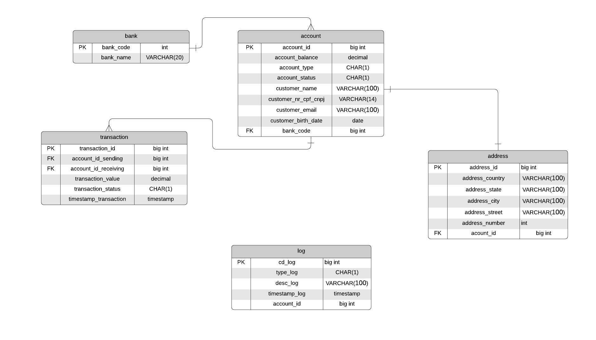
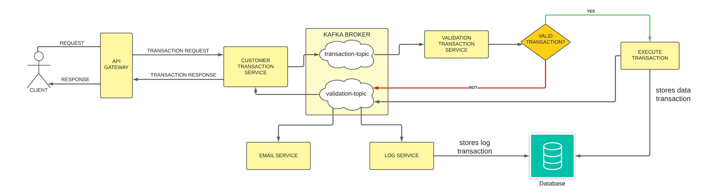

# sistema de transações bancárias

## Sobre a aplicação

O sistema simula um fluxo de transação bancária, desde a criação de um banco até o ponto da transação. Neste sistema, 
é possível criar um banco, cadastrar contas para o banco, e durante o registro da conta do cliente, será registrado também
seu endereço.
 Ele atua de maneira simplificada, onde o intuito é implementar uma aplicação baseada em uma arquitetura de micro 
serviços inteligados por transmissões de eventos, em que cada serviço é trabalho com os critérios da arquitetura limpa, 
princípios SOLID e seus padrões.

## Modelo de relacionamento entre as entidades

## Como funciona

### Transferência

O cliente passará os parâmetros da transferência desejada, assim como o tipo de transação, sendo (T) para uma 
transferência comum e (R) para solicitação de reembolso. Para ambos os tipos de solicitação, o fluxo seguirá o mesmo.
 O sucesso da transação irá depender da autenticidade dos dados passados, assim como a disponibilidade de saldo na conta
bancária. 

## Regras da aplicação:

- O email da conta deve ser único
- O cpf ou cnpj cadastrado deve ser único.
- Não será possível transferir um valor maior do que o saldo da conta
- Uma conta cujo cliente possuir idade menor que 6 não será criada
- Um código do banco deve ser único
- Todas as transações devem ser registradas
- Uma conta que é bloqueada, não pode fazer nenhuma transação, mas o seu saldo se permanece
- Uma conta que é cancelada, só poderá ser cancelada se possuir saldo zerado
- A transferência será válida se o cliente possuir saldo em conta disponível

## Informação sobre os dados:
### tabela account

- account_type: (F) -> Conta de pessoa física, (J) -> Conta de pessoa jurídica
- account_status (A) -> Conta ativa, (B) -> Conta bloqueada, (C) -> Conta cancelada

### tabela transaction

- transaction_status: (S) -> Transação concluída com sucesso, (F) -> Transação com falha

### tabela log

- type_log: (E) -> Erro, (S) -> Indica sucesso

## Funcionalidades
### Banco
- Criar banco
- Listar todos os bancos
- Listar bancos por nome
- Buscar banco por código do banco

### Conta
- Criar conta
- Listar contas por cidade
- Listar contas por estado
- Buscar conta por código da conta
- Listar contas por cpf ou cnpj da conta cadastrada
<<<<<<< HEAD
- Listar contas com saldo maior ou igual que o parâmetro informado
- Listar contas com saldo menor ou gual que o parâmetro informado
- Realizar transação
=======
- Ativar conta
- Bloquear conta
- Cancelar conta
- Realizar transferência
- Solicitar reembolso
- Realizar pagamento
>>>>>>> 9c11d82a12537b697e835540ba0a513d7d090823
- Alterar dados da conta

### Endereço
- Criar endereço
- Listar endereço por cpf ou cnpj da conta

## Tecnologias utilizadas

### Linguagem
- Java - versão 11

### Frameworks e APIs de desenvolvimento
- Spring Boot
- Spring Cloud
- Spring Data
- Hibernate
- JavaMail

### Frameworks de testes
- JUnit
- Mockito

### Bibliotecas auxiliares
- Lombok
- ModelMapper

### Banco de dados
- MySQL para armazenar dados em produção
- PostgreSQL para realização desenvolvimento e testes

### Gerenciamento da aplicação
- Azure Cloud

### Mensageria
- Apache Kafka

### Teste de requisições
- Postman
