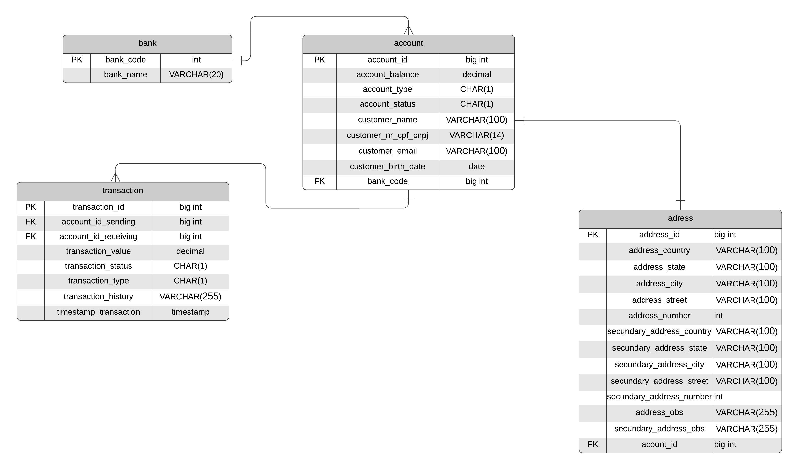

# serviço de pagamento bancário
Serviço de pagamento bancário, simulando os passos para realizar um pagamento

## Modelo de relacionamento entre as entidades

## Como funciona

### Transferência
Uma conta que possui um determinado tipo, sendo (F) para conta de pessoa física e (J) para conta de pessoa jurídica, poderá efetuar transferência para outras contas desde que exista saldo em sua conta. A transferência será efetuada quando passado os dados da conta que receberá a transferência:
- código do banco
- código da conta
- cpf ou cnpj da conta cadastrada
- valor da transferência
  
 Após a conclusão da transferência, será enviado um email para o proprietário informando sucesso ou fracasso da transferência e será gerado um histórico de transação, informando o tipo da transação e um campo informando o registro da ação
  realizada.

### Reembolso
Em um caso onde ocorre uma transferência concluída mas não desejada, será possível solicitar o reembolso, passando os seguintes parâmetros:
- código do banco
- código da conta
- cpf ou cnpj da conta transferida
- valor da transferência
- data da transferência

A validação para o reembolso é simples, se os parâmetros da solicitação estiverem corretos e a conta que recebeu a transferência possuir saldo, então será realizada a transação. Após a conclusão da transferência, será enviado um email para o proprietário informando sucesso ou fracasso da transferência e será gerado um histórico de transação, informando o tipo da transação e um campo informando o registro da ação realizada.

### Boleto e Cartão
Para essa forma de pagamento, será realizada da mesma forma que a transferência, passando os dados da conta que receberá a transferência:
- código do banco
- código da conta
- cpf ou cnpj da conta cadastrada
- valor da transferência

Para essas formas de pagamento não serão solicitado código de fatura ou boleto, apenas serão lançados no registro de transação com suas formas de pagamento.

## Regras da aplicação:

- Será criada apenas uma conta por cpf ou cnpj informado
- O email da conta deve ser único
- O cpf ou cnpj cadastrado deve ser único.
- Não será possível transferir um valor maior do que o saldo da conta
- Uma conta cujo cliente possuir idade menor que 6 não será criada
- Um código do banco deve ser único
- Todas as transações devem ser registradas
- Uma conta com que é bloqueada, não pode fazer nenhuma transação ou solicitação de reembolso, mas o seu saldo se permanece
- Uma conta que é cancelada, só poderá ser cancelada se possuir saldo zerado
- Em caso de uma conta Jurídica, apenas o primeironome será lançado

## Informação sobre os dados:
### tabela account

- account_type: (F) -> Conta de pessoa física, (J) -> Conta de pessoa jurídica
- account_status (A) -> Conta ativa, (B) -> Conta bloqueada, (C) -> Conta cancelada

### tabela transaction

- transaction_status: (S) -> Transação concluída com sucesso, (F) -> Transação com falha
- transaction_type: (T) -> Transferência, (R) -> Reembolso, (B) -> Boleto, (C) -> Cartão

## Funcionalidades

- Criar conta
- Criar endereço
- Criar banco
- Listar contas por código da conta
- Listar cliente por códido do banco
- Listar conta por cpf ou cnpj da conta cadastrada
- Listar contas com saldo maior ou igual que o parâmetro informado
- Listar contas com saldo menor ou gual que o parâmetro informado
- Listar endereço por cpf ou cnpj da conta
- Listar contas por cidade
- Listar contas por estado
- Listar conta por código da conta
- Realizar transferência
- Solicitar reembolso
- Realizar pagamento
- Alterar dados da conta

## Tecnologias utilizadas

### Linguagem
- Java - versão 11

### Frameworks e APIs de desenvolvimento
- Spring Boot
- Spring Cloud
- Spring Data
- Hibernate
- JavaMail

### Frameworks de testes
- JUnit
- Mockito

### Bibliotecas auxiliares
- Lombok
- ModelMapper

### Banco de dados
- PostgreSQL

### Gerenciamento da aplicação
- Azure Cloud

### Teste de requisições
- Postman
